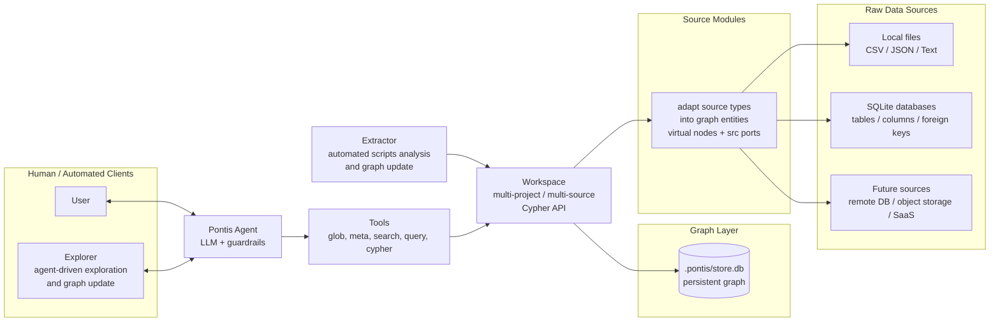

<div align="center">

# Pontis

**A graph-native memory layer for data projects and AI agents.**

Let AI understand the structure, relationships and accumulated knowledge of a data project before answering questions.


</div>

---

Pontis is a knowledge graph workspace for data projects and AI agents. Instead of LLM using different api to access different types of data source, it organizes HETEROGENEOUS data into a queryable, updatable and reusable graph that can be explored through Cypher.

The graph describes the sources themselves and preserves the knowledge produced during analysis: tables and columns, files and directories, foreign keys and semantic relationships, statistical summaries, manual corrections and cross-project experience. Agents access this graph through tools and Cypher, then return to the original data only when precise execution is needed.

## Why Pontis

When an LLM reads a data project directly, three problems show up quickly:

- Context is too coarse: large tables, long files and complex directories cannot fit cleanly into a prompt.
- Relationships are too implicit: joins, column meanings, JSON structure and project conventions are scattered across the data.
- Experience is too short-lived: conclusions from one analysis are rediscovered again in the next task.

Pontis introduces a stable middle layer:

```text
Raw Project
    -> Source Modules
    -> Graph Workspace
    -> Extractors / Tools / Agent
    -> Reusable Project Knowledge
```

Raw data stays where it is. Pontis builds a structured reasoning layer over it.

## Architecture



The important boundary is simple: **`Workspace.cypher(...)` is the graph API.**

Source modules expose virtual entities and native source ports. The persistent store keeps user knowledge, extracted metadata and graph edges. Read queries can merge persisted graph data with live virtual entities; write queries materialize only the graph entities they touch.

## Core Ideas

**Graph first.** Files, tables, columns, foreign keys, summaries and learned rules are all graph nodes or edges. The agent does not need to memorize path conventions; it can ask the graph.

**Virtual before persistent.** A project can expose live file system and SQLite schema nodes without eagerly writing everything into `.pontis/store.db`. Persistence is reserved for extracted facts, user knowledge and touched virtual entities.

**Thin source access.** Storage does not try to become a universal data platform. A node can bind to native ports such as file path, `open(...)` or SQLite connection, while higher-level behavior stays in tools and extractors.

**Agent with rails.** The agent is assembled from mode-specific prompts, tools and guardrails. Read-only analysis, writer workflows, sub-agent work and benchmark runs share the same loop but use different capabilities.

## Main Components

| Layer | Responsibility |
| --- | --- |
| `storage/` | Property graph, SQLite backend, Cypher execution, merged virtual/persistent read view |
| `storage/stores/` | Source modules such as file system discovery and SQLite schema projection |
| `extractor/` | Automated script-based analysis that profiles data projects and writes derived knowledge back to the graph |
| `explorer/` | Agent-driven analysis that explores a data project, discovers higher-level structure and updates the graph |
| `tool/` | Agent-facing operations: `glob`, `meta`, `search`, `query`, `cypher`, write tools |
| `agent/` | Tool-calling loop, prompt assembly, mode presets and guardrails |
| `docs/` | Design notes, refactor plans, benchmark analysis and deeper architecture records |

## Quick Start

Install dependencies:

```bash
pip install -e .
```

Configure an LLM provider with environment variables or `~/.pontis/config.yml`:

```bash
export PONTIS_AGENT_API_KEY=...
export PONTIS_EXTRACTOR_API_KEY=...
```

List extractor modules:

```bash
python -m extractor list
```

Run selected extraction passes on a project:

```bash
python -m extractor run db_column_stats_approx,db_fk_validate ./my_project
```

Start an interactive agent session:

```bash
pontis ./my_project
```

Run direct graph/tool commands:

```bash
pontis ./my_project:glob "*.db"
pontis ./my_project:meta "example.sqlite"
pontis ./my_project:cypher "MATCH (n) RETURN n"
```

## Project Layout

```text
Pontis/
├── agent/          # Agent loop, mode config, prompts and guardrails
├── extractor/      # Extraction engine and modular analysis passes
├── storage/        # Graph store, Cypher engine, source modules and backend
├── tool/           # CLI and agent tools over the workspace
├── docs/           # Architecture notes and design records
├── scripts/        # Benchmarks, migration helpers and web prototype
├── pontis_cli.py   # CLI entry point
├── pontis.yml      # Example project registry
└── pyproject.toml
```

## Current Shape

Pontis is still in an active design phase. The direction is already clear: a graph-first workspace with virtual source modules, Cypher as the public graph surface, and tools/agents as consumers.

Some implementation areas are intentionally transitional:

- Storage still carries a few compatibility paths while the Cypher boundary is being tightened.
- Extractors are moving toward “derive knowledge” rather than “own schema modeling”.
- More source lifecycle work is planned around stale entities, provenance and incremental sync.

Detailed design discussion lives in `docs/`; the README is only the front door.
