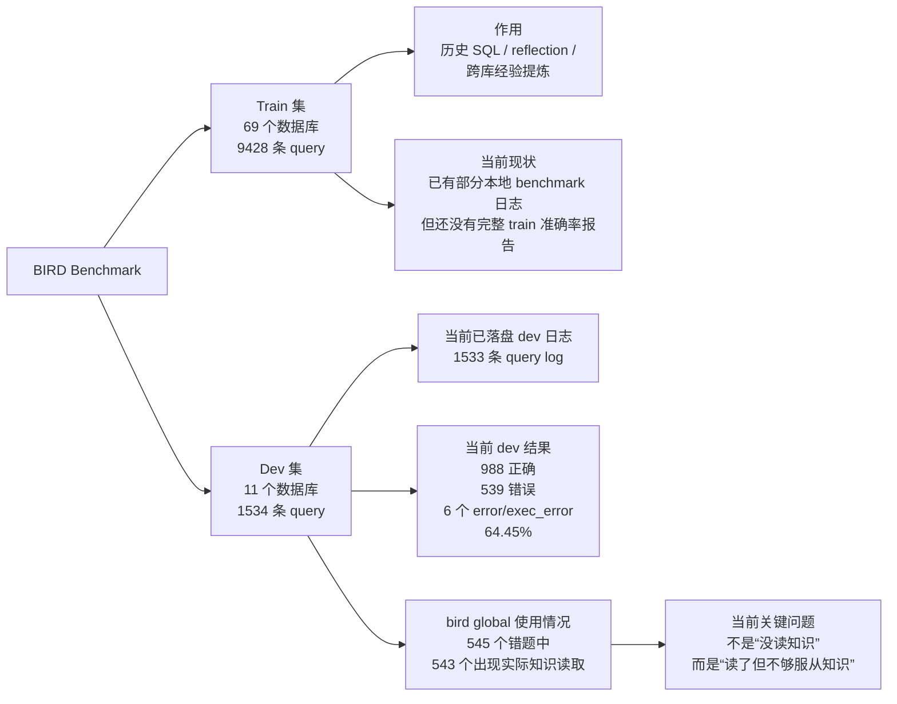

# BIRD Benchmark 阶段性分析报告

## 1. 背景：我们为什么要看 BIRD

如果把当前项目理解成一个 **data agent**，那么它的核心能力不是“会不会写一条 SQL”，而是：

1. 能不能先读懂一个全新的数据项目
2. 能不能在没有先验 schema 记忆的情况下做结构探索
3. 能不能把自然语言问题稳定翻译成 SQL
4. 能不能把过去做题积累下来的经验迁移到新的数据库上

BIRD 正好非常适合衡量这件事。

它不是单库训练集，而是一个 **跨数据库 Text-to-SQL benchmark**：

- 每个数据库都是一个独立项目
- train 和 dev 使用的是不同数据库
- 因此它天然可以测试 agent 的 **跨库泛化能力**

从 data agent 视角看，BIRD 的价值不只是“算一个准确率”，而是能把问题拆成三层：

1. **局部理解能力**
   - 当前库的 schema、列语义、关系、README、知识节点是否读懂了
2. **通用 SQL 能力**
   - 聚合、排序、比例、时间处理、连接方式是否稳定
3. **经验迁移能力**
   - train 中积累的跨库经验，是否真的能迁移到 dev 上

所以这份报告的目标不是单纯汇报分数，而是回答：

**当前 data agent 在 BIRD 上到底卡在“局部理解”、“通用 SQL 习惯”，还是“跨库经验迁移”这三者中的哪一层。**

## 2. 数据集结构

当前 BIRD 数据集可以简单理解成两部分：

- **Train 集**
  - 用来提供历史 SQL、反思案例、跨库知识提炼素材
- **Dev 集**
  - 用来评估 agent 在未见数据库上的真实泛化效果

当前规模如下：

| 划分 | 数据库数 | Query 数 | 当前角色 |
|---|---:|---:|---|
| Train | 69 | 9428 | 历史 SQL 与跨库经验来源 |
| Dev | 11 | 1534 | 当前主要评测目标 |

最关键的性质是：

- **train 和 dev 的数据库没有重叠**

这意味着 train 不能直接作为“模板 SQL 检索库”来用。  
真正可以迁移的，只能是：

- 抽象的 SQL 模式
- 可复用的审题习惯
- 通用的错误规避规则

这也是为什么我们专门维护了 `bird global` 经验库：  
它的目标不是记住 train 的具体 SQL，而是把 train 中能迁移的经验抽象出来。

## 3. 当前整体状态



这里要特别说明两点：

1. 当前仓库里，train 侧已经有部分 benchmark 结果和日志，但**还没有统一整理成一份完整的 train 准确率报告**。  
   所以目前最可靠、最完整的评测结论仍然来自 dev。

2. 当前 `example_data/bird_dev/dev_databases` 下已落盘的 benchmark 日志共有 **1533** 条，比理论上的 1534 少 1 条。  
   因此下面的统计是基于 **当前实际落盘结果**。

## 4. Dev 集当前结果

| 数据库 | 总题数 | 正确 | 错误 | Error / ExecError | 准确率 |
|---|---:|---:|---:|---:|---:|
| `california_schools` | 89 | 49 | 39 | 1 | 55.06% |
| `card_games` | 191 | 108 | 83 | 0 | 56.54% |
| `codebase_community` | 185 | 125 | 60 | 0 | 67.57% |
| `debit_card_specializing` | 64 | 44 | 20 | 0 | 68.75% |
| `european_football_2` | 129 | 88 | 41 | 0 | 68.22% |
| `financial` | 106 | 70 | 35 | 1 | 66.04% |
| `formula_1` | 174 | 96 | 76 | 2 | 55.17% |
| `student_club` | 158 | 124 | 32 | 2 | 78.48% |
| `superhero` | 129 | 110 | 19 | 0 | 85.27% |
| `thrombosis_prediction` | 163 | 83 | 80 | 0 | 50.92% |
| `toxicology` | 145 | 91 | 54 | 0 | 62.76% |
| **总体** | **1533** | **988** | **539** | **6** | **64.45%** |

从结果看，当前 dev 表现不是均匀的，而是明显分层：

- 表现较好：
  - `superhero` 85.27%
  - `student_club` 78.48%

- 中等：
  - `debit_card_specializing`
  - `european_football_2`
  - `codebase_community`
  - `financial`

- 较差：
  - `thrombosis_prediction` 50.92%
  - `california_schools` 55.06%
  - `formula_1` 55.17%
  - `card_games` 56.54%

这说明当前问题并不是单一的“模型能力不够”，而是：

- 某些数据库的错误高度集中在特定类型
- 不同库暴露出来的是不同层次的 agent 缺陷

## 5. 一个重要发现：agent 其实已经在频繁读取 bird global

如果只看错题日志，当前最值得强调的发现不是“经验库不够大”，而是：

**agent 基本上已经会去读 `bird global`，但这些知识还没有稳定地约束最终 SQL。**

统计结果：

- `WRONG / ERROR / EXEC_ERROR` 总数：**545**
- 其中出现了实际 `bird::*:knowledge` 读取行为的：**543**
- 没出现实际 `bird` 读取的：**2**

这说明现在的主要矛盾不是：

- “没有知识”
- “没去读知识”

而是：

- **知识读到了，但经常只是参考意见，不是最终决策的硬约束**

换句话说，当前 `bird global` 的问题更像是：

- **可见性已经够了**
- **约束力还不够**

这是一个非常重要的阶段判断，因为它决定了后续优化方向：

- 现在不应该只继续堆知识条目
- 更重要的是让模型 **更严格地服从已经读到的知识**

## 6. Dev 集当前错因分析

从 data agent 视角看，当前 dev 错误可以分成三层：

1. **可迁移错误**
   - 属于通用 SQL 模式错误
   - 理论上可以通过 train 历史 SQL 或更强的 bird global 来改善
2. **半可迁移错误**
   - train 能提供方向，但最终仍然依赖本库 schema 理解
3. **本库特有错误**
   - 基本依赖当前数据库的局部知识，train 很难直接帮忙

下面分别展开。

### 6.1 可迁移错误：这类最适合从 train 抽象经验

这类错误的关键特征是：

- 不依赖某个数据库的特殊表名或列名
- 更像是通用的 SQL 构造习惯不稳定

#### A. 百分比 / 比率公式类

典型题目：

- `thrombosis_prediction/q1149`
- `thrombosis_prediction/q1160`
- `card_games/q352`
- `codebase_community/q557`

主要问题：

- 分子分母范围不一致
- 忘记乘 `100`
- 不该去重时加了 `DISTINCT`
- 只学到了“这是 percentage”，但没有严格照 evidence 公式翻译

这类问题很适合从 train 迁移，因为：

- 它本质上是公式翻译问题
- 不是 schema 命名问题
- train 中完全可以抽取出稳定规则，例如：
  - 百分比通常输出 `0-100`
  - 分母应与过滤后的人群保持一致
  - evidence 中的公式优先机械翻译

#### B. 聚合粒度 / COUNT 口径类

典型题目：

- `card_games/q499`
- `codebase_community/q605`
- `codebase_community/q571`
- `thrombosis_prediction/q1167`

主要问题：

- `COUNT(*)`
- `COUNT(id)`
- `COUNT(DISTINCT entity)`

这几种统计粒度被混用了。

当前模型经常会按“业务语义看起来更合理”的方式选 `DISTINCT`，但 benchmark 要的是另一种 grain。

这类错误也很适合 train 迁移，因为：

- 它是典型的通用 Text-to-SQL 错误
- train SQL 可以帮助模型学会什么时候数行，什么时候数实体

#### C. 单数最高级 / 单结果选择类

典型题目：

- `formula_1/q1000`
- `formula_1/q1007`
- `california_schools/q10`
- `california_schools/q19`
- `california_schools/q68`
- `california_schools/q79`

主要问题：

- 没有稳定遵守 `ORDER BY ... LIMIT 1`
- 或者用了 `LIMIT 1`，但输出列不对

这类问题的迁移性也比较强，因为：

- `youngest / oldest / most recent / highest / lowest`
  这些表述是高度可复用的
- 这更像审题模式问题，不是某个库的局部事实

#### D. 输出契约类

典型题目：

- `card_games/q340`
- `card_games/q341`
- `card_games/q343`
- `thrombosis_prediction/q1177`

主要问题：

- golden 要 `id`，模型返回了 `name`
- 多返回了额外列
- 大小写不一致，例如 `normal` vs `Normal`
- 问题只要一个结果值，模型多返回了解释性列

这类问题同样适合 train 迁移，因为它反映的是：

- benchmark 输出契约意识不够强
- 不是 schema 理解不到位

### 6.2 半可迁移错误：train 能给方向，但还不够

这类错误 train 能帮一部分，但最终仍然要靠当前库的局部理解。

#### A. 时间 / 时长字段是文本

典型题目：

- `formula_1/q1006`
- `formula_1/q1007`
- `formula_1/q1010`
- `formula_1/q973`

主要问题：

- 模型知道问题是在问最快、最晚、最长
- 但不知道当前库里到底该按：
  - 文本时间列
  - 数值伴随列（例如 `milliseconds`）
  - 还是解析表达式
 进行排序

为什么只是半可迁移：

- train 可以教“文本时间列不能直接按字符串排序”
- 但当前库里到底哪个列最 authoritative，仍然是本库问题

#### B. 日期 / 年龄计算口径

典型题目：

- `thrombosis_prediction/q1168`
- `thrombosis_prediction/q1175`

主要问题：

- 模型倾向于采用更“真实”的年龄算法
- 但 evidence 和 golden 常常只要求一个 benchmark 风格的年份差

为什么只是半可迁移：

- train 可以教“evidence 的 year-diff 应按字面优先”
- 但具体取哪两个日期列，仍然取决于当前 schema

### 6.3 本库特有错误：这类最难靠 train 单独解决

这类错误主要来自：

- 当前库脏数据
- 当前库特有 schema 语义
- 当前库独特的长列名和近义列
- benchmark 在当前库上的特殊口径

#### A. `california_schools`：本库特性最强

这是当前最典型的低迁移性数据库。

主要问题：

- `satscores.cds` 和 `schools.CDSCode` 的前导零问题
- FRPM 表和 schools 表中存在大量长列名和近义列
- 某些题 golden 偏好“字面答案”，而不是更鲁棒的数据清洗写法

典型题目：

- `q10`
- `q16`
- `q24`
- `q25`

为什么 train 帮助有限：

- train SQL 不会告诉模型这个 dev 库里哪条 join 是脏的
- 也不会告诉模型当前库里哪两个近义列该选哪一个

#### B. `thrombosis_prediction`：医学语义强依赖当前库

例如：

- `aCL IgM`
- `aCL IgA`
- `aCL IgG`
- 某些概念到底属于 `Laboratory` 还是 `Examination`

这类问题高度依赖当前数据库自己的医学命名体系，train 很难直接迁移。

#### C. 部分 benchmark 本身是“局部怪口径”

还有一类题，问题不完全在 agent，也不完全在数据库，而在于：

- golden 的偏好非常字面
- 某些“更合理”的 SQL 也会被判错

这类题不适合直接沉淀成强规则，否则会污染 `bird global`。

## 7. Schema linking 成功之后，Text-to-SQL 仍会错在哪里

如果把 Pontis 的目标重新表述为“提升 agent 对数据库的理解”，那么 schema linking 是一个非常关键的中间指标。但它不能完全替代最终 EX，因为 schema linking 只回答：

> 模型是否找到了 gold SQL 需要的表和列？

它不直接回答：

> 模型是否用正确的 SQL 逻辑、聚合粒度、过滤口径和输出契约组合了这些表列？

因此，即使 gold tables 和 gold columns 都被成功选中，Text-to-SQL 仍然可能因为下面几类原因失败。

### 7.0 “等结构性”的定义

为了把“数据库理解”和“SQL 组织逻辑”分开，本文引入一个工作术语：**SQL 等结构性**。

直观定义：

> 如果两个 SQL 绑定到同一批数据库信息，那么它们在数据库理解层面是等结构的；它们可以在聚合、排序、子查询、输出格式等 SQL 组织方式上不同。

这个第一版直觉是对的，但如果只比较表集合和列集合，会漏掉一些“表列都找到了，但数据库理解仍然不深”的错误。因此本文把等结构性拆成三个层级，而不是只给一个二值定义。

形式化地说，将一个 SQL 拆成两部分：

```text
SQL = Database Grounding + SQL Logical Form
```

其中：

- `Database Grounding`：表、列、join 关系、过滤 literal、数据库局部值和局部术语。
- `SQL Logical Form`：SELECT 投影方式、WHERE 组合方式、聚合、GROUP BY、HAVING、ORDER BY、LIMIT、子查询、集合操作、输出契约。

对一条 SQL `q`，定义它的数据库绑定抽取函数：

```text
G(q) = (T(q), C(q), J(q), P(q), R(q))
```

其中：

- `T(q)`：SQL 中使用的物理表集合。
- `C(q)`：SQL 中使用的表限定列集合，例如 `cards.id`。
- `J(q)`：SQL 中显式出现的 join 列对集合，例如 `cards.setCode = sets.code`。
- `P(q)`：列、比较符和值绑定后的过滤谓词集合，例如 `cards.rarity = 'rare'`、`schools.year >= 2020`。
- `R(q)`：列在 SQL 中承担的角色，例如 projection、filter、join、group、order、aggregate。

本文使用三个层次的等结构性：

| 名称 | 判定 | 含义 |
|---|---|---|
| Schema 等结构性 | `T(pred)=T(gold)` 且 `C(pred)=C(gold)` | 表和列完全一致，接近传统 schema linking |
| Grounding 等结构性 | `T/C/J/P` 均一致 | 表、列、join pair、列绑定过滤谓词都一致 |
| Role-aware 等结构性 | `T/C/J/P/R` 均一致 | 进一步要求列在 SELECT、WHERE、JOIN、GROUP、ORDER、聚合中的角色一致 |

Schema 等结构性更接近传统 schema linking：它回答“是否找到了同一批表列”。Grounding 等结构性进一步要求 join 路径和具体过滤谓词也一致。Role-aware 等结构性再要求同一列在 SQL 中承担同样的结构角色。

需要强调的是：等结构性不是 SQL 等价性。下面两条 SQL 在宽松甚至严格等结构意义下可能相同，但 EX 可以不同：

```sql
SELECT COUNT(*) FROM badges WHERE name = 'Nice Answer';
SELECT COUNT(DISTINCT UserId) FROM badges WHERE name = 'Nice Answer';
```

它们绑定到同一张表、同一列和同一个过滤值，但 SQL logical form 中的聚合粒度不同。因此，等结构性适合衡量 Pontis 是否理解了数据库，不适合替代最终 EX。

第一版只用 `T/C/J/V` 的定义会漏掉以下情况：

1. **literal 没有绑定到列和操作符。**  
   `status = 'A'` 和 `type = 'A'` 可能拥有相同 literal，但数据库含义完全不同。因此需要 `P(q)` 记录 `column operator value`。

2. **同一批列承担了不同角色。**  
   `SELECT name WHERE id = 1` 和 `SELECT id WHERE name = 'A'` 可能使用相同表列集合，但 projection 和 filter 角色互换。因此需要 `R(q)`。

3. **操作符口径不同。**  
   `age > 30` 与 `age >= 30`，`name = 'A'` 与 `name LIKE '%A%'`，表列和值都可能相同，但条件语义不同。因此谓词必须包含操作符。

4. **join 路径表面相同但连接角色不充分。**  
   仅比较表列集合无法发现遗漏桥接表、连接列配错、或 shortcut join。至少需要 `J(q)`；更严格时还应记录 join type，例如 `LEFT JOIN` 与 `INNER JOIN`。

5. **未限定列名无法可靠归属。**  
   多表查询中未加表前缀的同名列，如果解析器无法唯一归属，应计入 `unresolved_columns`，不能直接判定等结构。

6. **函数包裹的局部值语义。**  
   `strftime('%Y', date)` 和直接使用 `date` 列都绑定同一列，但前者取年份，后者取完整日期。这更接近 SQL logical form，但在日期/时间字段上也反映数据库值格式理解不足，需要人工错因或后续扩展记录函数角色。

当前工具实现位于：

```text
tools/compare_sql_grounding.py
```

工具输出中的字段对应如下：

| 工具字段 | 文档概念 |
|---|---|
| `structural_equivalence` | Schema 等结构性 |
| `strict_structural_equivalence` / `exact_grounding_match` | Grounding 等结构性 |
| `role_aware_structural_equivalence` | Role-aware 等结构性 |
| `strict_schema_recall` | gold 表列是否被 predicted 全覆盖 |

最终建议：

- 如果论文要证明 Pontis 提升数据库理解能力，优先报告 `strict_schema_recall` 和 Schema 等结构性。
- 如果要判断“数据库 grounding 是否完全找对”，报告 Grounding 等结构性。
- 如果要进一步排除 projection/filter/order 角色错位，报告 Role-aware 等结构性。
- 不要用任何一种等结构性替代 EX；等结构性用于定位失败发生在 database grounding 还是 SQL logical form。

### 7.1 聚合粒度错误

这是 schema linking 成功后最常见的错误之一。模型选中了正确表和正确列，但不知道应该数“行”、数“实体”，还是数“去重实体”。

典型形式：

- `COUNT(*)` vs `COUNT(id)`
- `COUNT(id)` vs `COUNT(DISTINCT id)`
- `AVG` / `SUM` 的分组对象不对
- 先过滤再聚合，还是先聚合再过滤

例如 `codebase_community/q605` 中，agent 已经查出了 `COUNT(*) = 207` 和 `COUNT(DISTINCT UserId) = 98`，但最后仍然选择了自己认为更合理的 `COUNT(DISTINCT UserId)`。这说明 schema 已经找对，失败点在 benchmark 对统计粒度的偏好。

### 7.2 WHERE 条件口径错误

模型可能选中了正确列，但过滤条件仍然错。

常见情况：

- 自然语言值没有映射到数据库真实枚举值
- 大小写、缩写、别名、空格格式不一致
- 范围边界错，例如 `>` vs `>=`
- 日期范围是否包含端点不一致
- evidence 中的过滤条件没有完全落实

这类错误处在 schema linking 和 value grounding 的交界处。表列选择成功只能说明“去哪里找”，不能保证“找哪个具体值”和“怎么比较”是对的。

### 7.3 JOIN 路径或连接条件错误

如果 schema linking 的定义只是 gold 表集合和列集合都覆盖，那么 join 仍然可能错。

常见情况：

- 表和列都选中，但连接列配错
- 遗漏桥接表
- 使用了可执行但语义错误的 shortcut join
- 多条可行路径中选择了错误路径
- 脏数据导致字面外键和真实 join 口径不一致

这类错误说明 schema linking 指标最好拆成两层：

- table/column linking：是否找到相关表列
- relation/path linking：是否找到正确连接路径

Pontis 的 `overlap`、`fk`、`disambig`、bridge check 更适合解释第二层。

### 7.4 公式和计算表达式错误

BIRD 中很多题的 evidence 会给出公式或口径，尤其是 percentage、ratio、difference、year difference 等。

即使相关列全选对，SQL 仍可能错在：

- 分子分母范围不一致
- 忘记乘 `100`
- 整数除法或类型转换问题
- 差值方向反了
- 年龄或年份差按真实日期算法算，而不是按 evidence 字面算
- `CASE WHEN` 条件和外层过滤条件不一致

这类错误本质上是 logical form construction，不是 schema linking。

### 7.5 输出契约错误

模型可能算出了正确中间结果，但最终返回的列不符合 gold。

常见情况：

- 题目要 `id`，模型返回 `name`
- 题目要单列，模型返回多列
- 题目要实体属性，模型返回聚合值
- 多返回解释性列
- 排序后应返回对应行的某个字段，但模型返回排序字段本身

这类错误尤其适合用 `bird global` 抽象经验约束，因为它反映的是 benchmark 输出习惯，而不是某个数据库的局部结构。

### 7.6 排序、Top-k 和 tie-breaking 错误

最高、最低、最新、最早、最多等 superlative 问题，通常 schema linking 很容易成功，但 SQL 仍可能因为排序和 tie-breaking 失败。

常见情况：

- `ORDER BY` 方向反了
- 忘记 `LIMIT 1`
- 排序字段选对但输出字段不对
- 同分时是否需要额外排序不明确
- 用文本时间排序，而不是数值时间或日期解析

这类错误在 `formula_1` 和 `california_schools` 中比较典型。

### 7.7 SQL 结构组合错误

复杂查询需要嵌套、集合操作或多阶段聚合。表列找对后，模型仍可能不会正确组合 SQL 结构。

典型情况：

- 需要子查询但写成单层查询
- 需要 `HAVING` 但写成 `WHERE`
- 需要 `EXISTS` / `NOT EXISTS` 但写成普通 join
- 需要 `UNION` / `INTERSECT` / `EXCEPT` 但写成 OR 条件
- 多阶段聚合顺序错误

这类错误主要反映 SQL planning 能力。

### 7.8 NULL、重复行和数据库脏数据处理错误

真实数据库中经常有 NULL、重复记录、编码字段和脏 join。

即使 schema linking 成功，仍可能因为：

- 没有处理 `NULL`
- 错把空字符串当 NULL
- duplicate rows 导致计数偏差
- 脏外键需要 cast、trim 或补零
- 需要 `LEFT JOIN`，但模型用了 `INNER JOIN`

这类错误是 BIRD 比 Spider 更接近真实场景的地方。

### 7.9 Benchmark / gold 歧义

还有一类失败并不完全是模型错，而是题意、evidence 和 gold SQL 的口径存在模糊性。

表现为：

- 自然语言允许多个合理解释
- evidence 给出的公式和自然语言直觉冲突
- gold SQL 偏好某种非常字面的写法
- 业务上更合理的 SQL 被 EX 判错

这类 case 不适合用来证明 schema linking 不行，也不适合沉淀成强通用规则；更适合作为 benchmark 局限讨论。

### 7.10 对 Pontis 实验的启发

因此，后续如果引入 schema linking 成功率，建议不要只看单一指标，而是分层分析：

| 层级 | 问题 | 指标 |
|---|---|---|
| Schema understanding | 是否找到 gold 表和列 | Table/Column Recall、Strict Schema Recall |
| Relation understanding | 是否找到正确 join 路径 | Join Pair Recall、Bridge Table Recall |
| Value grounding | 是否找到正确过滤值和比较方式 | Value Recall、Condition Accuracy |
| Logical form | 是否正确组合聚合、排序、子查询和集合操作 | Component F1、人工错因分类 |
| Final execution | 最终结果是否一致 | EX |

最有价值的分析不是“schema linking 成功率是多少”本身，而是下面这个条件分解：

```text
EX | schema linking success
EX | schema linking failure
```

如果 `schema linking success` 后 EX 很高，说明 Pontis 的主要瓶颈确实是数据库理解；如果 schema linking 成功后 EX 仍然不高，说明主要瓶颈已经转移到 SQL 口径、公式翻译、聚合粒度和 benchmark 风格。

所以更准确的论文表述应该是：

> Schema linking 是衡量 Pontis 数据库理解能力的核心中间指标，但最终 Text-to-SQL 仍受 SQL logical form、value grounding、join path、aggregation grain 和 benchmark output contract 影响。本文同时报告 schema linking 与 EX，并通过条件 EX 分析区分“理解失败”和“生成失败”。

## 8. 当前最关键的判断：不是“没读知识”，而是“读了但没真正服从”

从日志里可以看到三种典型情况。

### 情况 A：读了，而且确实用上了

例子：

- `thrombosis_prediction/q1149`

这题里 agent 读取了和 percentage 相关的 bird 知识，最后确实用了：

- 条件计数
- `* 100`
- evidence 对齐的过滤

这说明 `bird global` 不是摆设，它已经能产生正向作用。

### 情况 B：读了，但只用对了一部分

例子：

- `formula_1/q1000`

它读了和 superlative 相关的规则，最后正确用了：

- `ORDER BY date DESC LIMIT 1`

但输出列仍然没完全贴 golden。

这说明知识进入了推理过程，但没有完全接管最终决策。

### 情况 C：读了，但最后还是让默认常识覆盖了知识

例子：

- `codebase_community/q605`

这题里 agent 自己查出了：

- `COUNT(*) = 207`
- `COUNT(DISTINCT UserId) = 98`

最后仍然选择 `COUNT(DISTINCT UserId)`，因为它觉得“obtained the badge”更像在问唯一用户数。

这正是当前最核心的问题：

- 知识被看到了
- 但模型自己的“常识 SQL 直觉”仍然更强

所以现阶段最重要的优化方向，不是继续扩充知识列表，而是：

**增强知识对最终 SQL 的约束力。**

## 9. 为什么 train → dev 的迁移天然很难

对于不熟悉 BIRD 的老师，这里需要强调一个事实：

我们现在做的，不是普通的“同库测试集”问题，而是“跨库迁移”问题。

train 和 dev 的数据库完全不同，这带来三个直接后果。

### 1. train 不能当模板库直接用

- 没有共享表名
- 没有共享列名
- 没有办法简单做 schema-level SQL retrieval

所以 train 真正能提供的，只能是抽象经验，而不是原样 SQL。

### 2. 很多 dev 错误其实是 schema-local 的

例如：

- 脏 join
- 近义列消歧
- 项目专有长列名

这类问题即使 train 里见过类似结构，也不会自动告诉模型当前 dev 库怎么选。

### 3. 当前 bird global 已经可见，但还不够“强制”

目前的问题不在于经验没整理出来，而在于：

- 经验检索还偏宽
- 最终生成时还偏弱约束

这意味着当前阶段继续单纯增加知识条目，边际收益会下降；  
下一步更应该研究的是：

- 哪些知识应该更早地被触发
- 哪些知识应该在最终 SQL 输出前变成 hard check

## 10. 现阶段的结论

如果把当前结果压缩成几句汇报结论，可以总结为：

1. **当前 data agent 在 BIRD dev 上的总体准确率为 64.45%。**
2. **当前主要困难不是“看不见经验”，而是“经验约束不住最终 SQL”。**
3. **dev 错误不是单一来源，而是三层混合：**
   - 可迁移的通用 SQL 模式错误
   - 需要 train + 本库共同解决的半可迁移错误
   - 明显依赖本库局部理解的 schema-local 错误
4. **train 的价值主要在于提炼抽象经验，而不是直接检索 SQL 模板。**
5. **下一阶段优化重点，应从“继续堆知识”转向“增强知识服从性与本库理解能力”。**

## 11. 下一步工作建议

如果目标是把这套系统继续往“成熟的 data agent”推进，当前最值得做的事情有三项。

### A. 强化可迁移知识

优先围绕以下几类高频错误继续抽象：

- 百分比 / 比率公式
- 聚合粒度
- 精确输出列
- 单结果 superlative

### B. 强化知识约束力

重点不是再让 agent 多读一遍 `bird global`，而是让它：

- 读到之后更难忽略
- 在最终 SQL 前显式检查自己是否违背了对应规则

### C. 强化本库理解层

特别是针对：

- `california_schools`
- `thrombosis_prediction`
- `formula_1`

这几个低分库，后续更值得做的是：

- 更强的 schema 消歧
- 更准确的局部知识表达
- 更谨慎的脏数据处理策略

一句话收束：

**当前系统已经具备“读知识”和“跨库尝试迁移”的能力，但距离稳定的 data agent 还差一步：让通用经验真正压住默认 SQL 直觉，同时补上对具体数据库局部结构的精细理解。**
